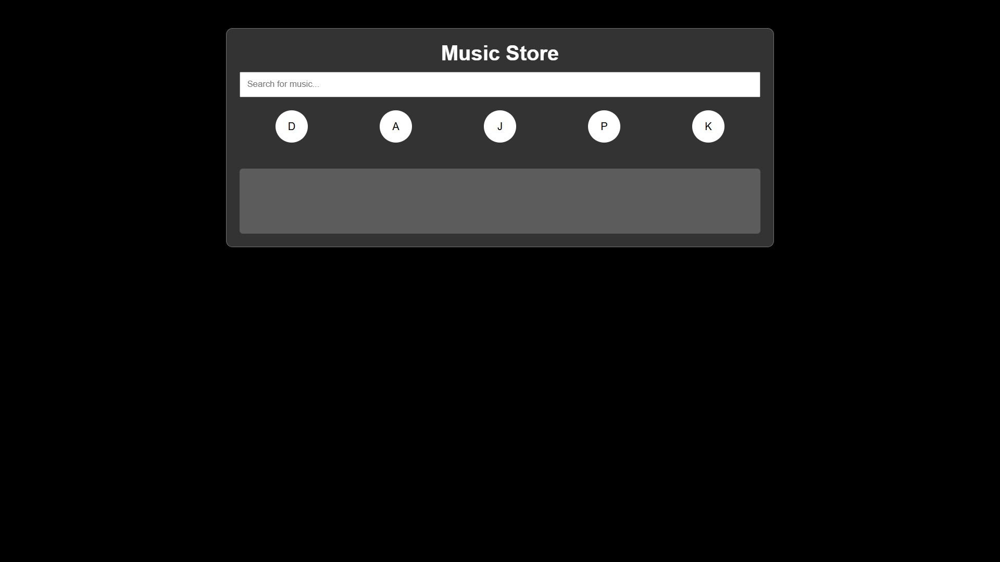
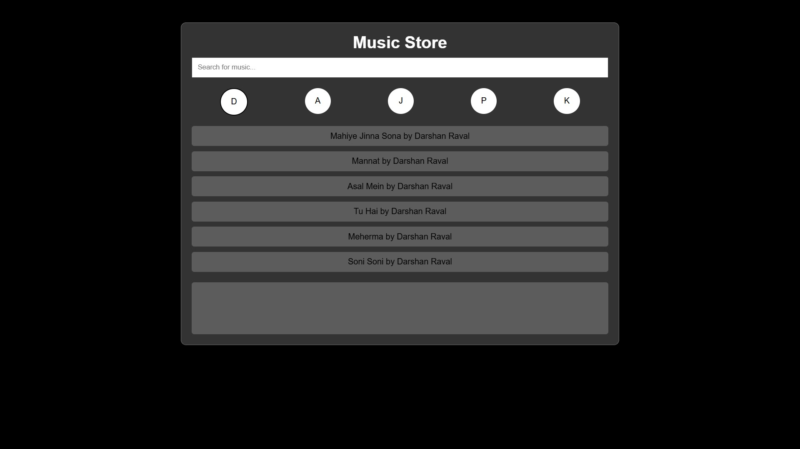
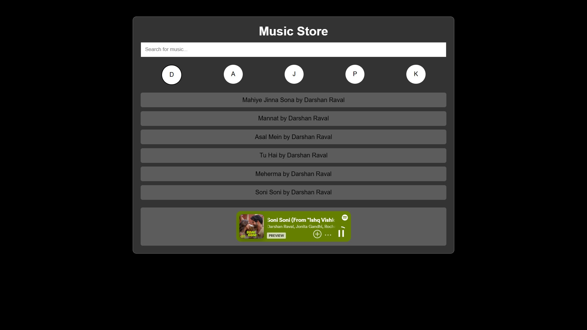

# Music Store

A simple web application to browse, search, and play music tracks by various artists.

## Features

- Browse music by artists.
- Search for music tracks by title.
- Play music tracks using the embedded Spotify player.

## Technologies Used

- HTML
- CSS
- JavaScript

## How to Use

1. **Clone the repository**:
   ```bash
   git clone https://github.com/your-username/music-store.git
   cd music-store
   ```

2. **Open `index.html` in a web browser**:
   Simply open the `index.html` file in your preferred web browser to view and use the Music Store.

## Project Structure

```plaintext
music-store/
├── index.html
├── style.css
└── script.js
```

### index.html

This file contains the HTML structure of the application.

### style.css

This file contains the CSS styles for the application, including the translucent glassmorphism effect for the UI components.

### script.js

This file contains the JavaScript code to handle artist selection, music filtering, and playing tracks.

## JavaScript Functions

- `renderArtists()`: Renders the list of artists.
- `renderMusicList(artistId)`: Renders the list of music tracks for the selected artist.
- `setSelectedArtist(selectedCircle)`: Highlights the selected artist circle.
- `searchInput.addEventListener('input', (event))`: Filters the music list based on the search input.

## Customization

You can customize the list of artists and music tracks by modifying the `artists` and `musicList` arrays in the `script.js` file.

## Example

```javascript
const artists = [
    { name: 'Darshan Raval', id: 1 },
    { name: 'Arijit Singh', id: 2 },
    { name: 'Jubin Nautiyal', id: 3 },
    { name: 'Pritam', id: 4 },
    { name: 'KK', id: 5 },
];

const musicList = [
    { title: 'Mahiye Jinna Sona by Darshan Raval', artistId: 1, url: 'https://open.spotify.com/embed/track/0Jiaz0O4AqnJICa9PxHhaR?si=c3a30c8bb2b14c33' },
    { title: 'Mannat by Darshan Raval', artistId: 1, url: 'https://open.spotify.com/embed/track/26elzgFl8tvajnDfeoY1YF?si=15b23ab9b88b4588' },
    // Add more music tracks here
];
```

## Screenshots




